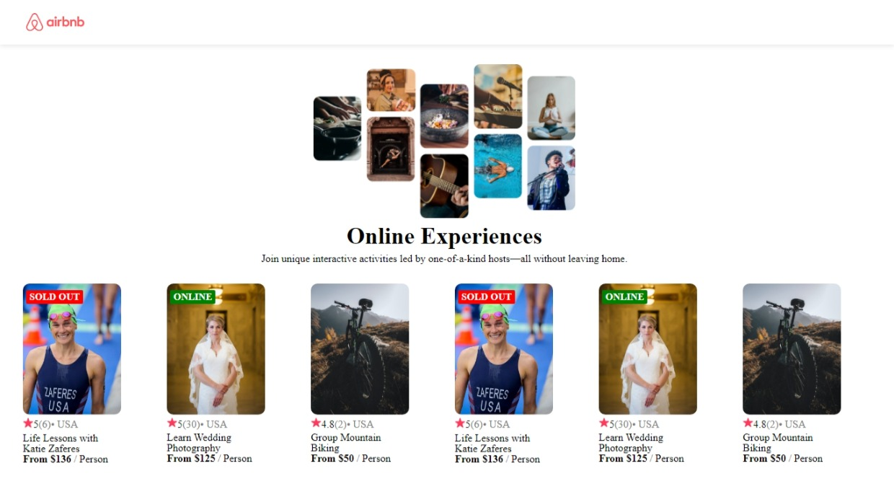

# Airbnb ReactCard!
Projeto desenvolvido como parte do treinamento da plataforma de ensino [Scrimba](https://scrimba.com/learn/learnreact)
## 🎯Objetivo do projeto
Criar um componente de cartão reutilizável, onde seria gerado a partir de um arquivo de dados sobre os usuários.

## ✏️ Resultado final

[Resultado final](https://airbnb-card-react.vercel.app/)

## 🖥️ Tecnologia utilizada

- JavaScript;
- ReactJS;
- SCSS